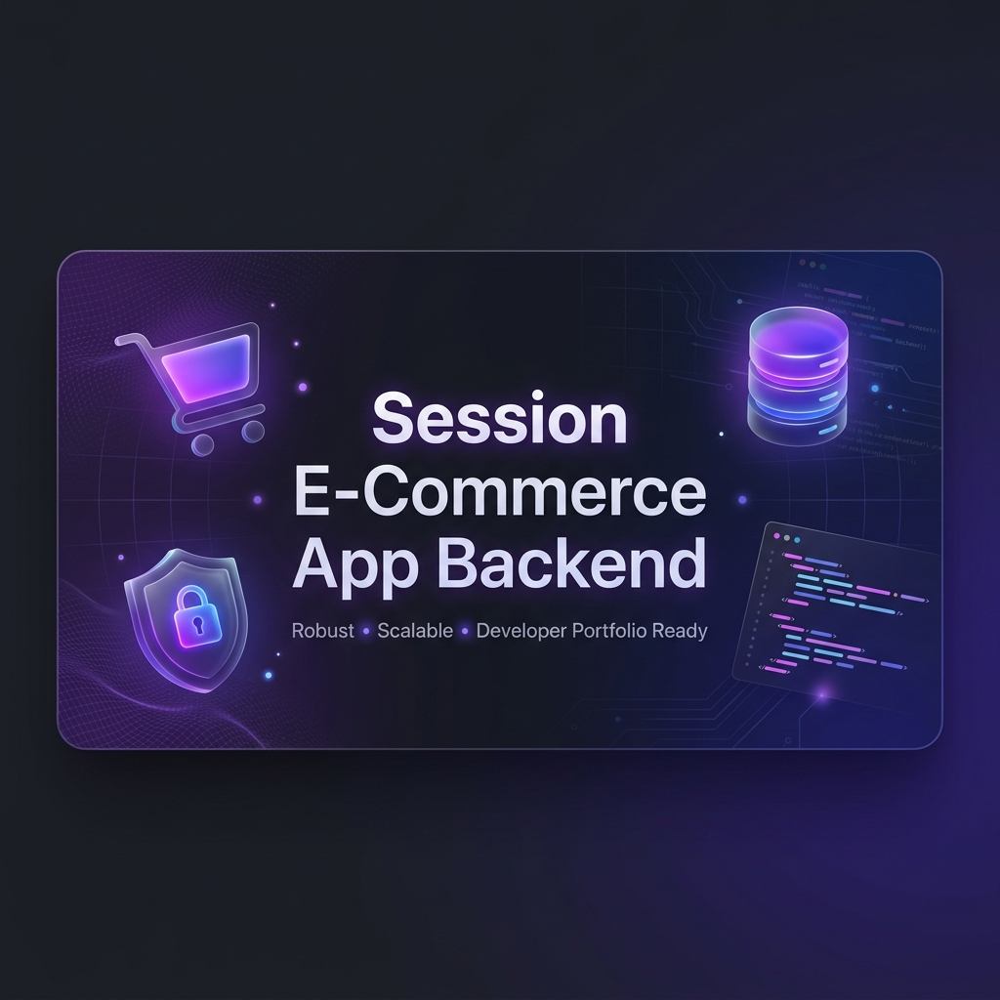

# 🛒 Session-Powered E-Commerce RESTful API



> **A robust, production-ready backend for modern e-commerce platforms.**  
> Built with Node.js, Express, and MongoDB, this project showcases advanced features like Stripe payments, Google OAuth, PDF invoice generation, and automated task scheduling.

---

## ⚡ Quick Links
- [🚀 Features](#-key-features)
- [🛠️ Tech Stack](#️-tech-stack)
- [📐 Architecture](#-system-architecture)
- [📦 Installation](#-getting-started)
- [📜 API Documentation](#-api-endpoints)

---

## 🚀 Key Features

### 🔐 Advanced Authentication & Security
- **Multi-Factor Auth Support**: Secure JWT-based authentication combined with email verification.
- **Social Login**: Seamless integration with **Google OAuth 2.0** via Passport.js.
- **Role-Based Access Control (RBAC)**: Distinct permissions for `Admin` and `User`.
- **Password Security**: Cryptographic hashing using `bcrypt`.

### 🛍️ Comprehensive Product Management
- **Hierarchical Categories**: Categories, Subcategories, and Brands management.
- **Rich Product Details**: Slugified URLs, Cloudinary-hosted images, stock management, and pricing.
- **User Reviews**: Integrated rating system for products to build trust.

### 💳 Seamless Checkout & Payments
- **Stripe Integration**: Professional payment processing for secure credit card transactions.
- **Smart Cart**: Cart persistence with real-time price updates and quantity management.
- **Coupon System**: Dynamic discount management with expiry dates (powered by `Luxon`).
- **Automated Invoices**: Dynamic **PDF Invoice Generation** upon order completion using `PDFKit`.

### ⚙️ Backend Excellence
- **Automated Scheduling**: Cron jobs via `node-schedule` for background tasks (e.g., cleaning expired coupons).
- **Media Management**: High-speed image uploads and transformations via **Cloudinary**.
- **Input Validation**: Bulletproof data validation using **Joi** schemas.

---

## 🛠️ Tech Stack

 
 
 
 
 
 
 


---

## 📐 System Architecture

The project follows a **Modular MVC Architecture**, ensuring scalability and maintainability.

```text
src/
├── modules/          # Domain-driven modules (User, Product, Order, etc.)
│   ├── User/
│   │   ├── user.controller.js
│   │   ├── user.router.js
│   │   └── user.validation.js
├── middleware/       # Custom auth, error handling, and file uploads
├── utils/            # Reusable helpers (Email, PDF Gen, General Utils)
└── database/         # MongoDB connection & Mongoose models
```

---

## 📦 Getting Started

### Prerequisites
- Node.js (v14+)
- MongoDB Atlas or Local Instance
- Cloudinary & Stripe Cloud Accounts

### Installation

1. **Clone the repository**
   ```bash
   git clone https://github.com/Abdelrahman2656/e-commerce.git
   cd e-commerce
   ```

2. **Install dependencies**
   ```bash
   npm install
   ```

3. **Environment Setup**
   Create a `.env` file in the root directory:
   ```env
   PORT=3000
   MONGO_URI=your_mongodb_uri
   JWT_SECRET=your_secret
   STRIPE_KEY=your_stripe_key
   CLOUDINARY_NAME=your_name
   # ... add other keys
   ```

4. **Run development server**
   ```bash
   npm start
   ```

---

## 📜 API Endpoints (Snapshot)

| Method | Endpoint | Description | Access |
| :--- | :--- | :--- | :--- |
| `POST` | `/api/v1/auth/signup` | Register new account | Public |
| `POST` | `/api/v1/product` | Create new product | Admin |
| `PATCH` | `/api/v1/cart` | Update cart items | User |
| `POST` | `/api/v1/order` | Place order & Pay | User |

> **Detailed documentation available at:** [Postman Collection Link / Swagger Link] (Coming soon)

---

## 🤝 Contributing
Contributions are what make the open source community such an amazing place to learn, inspire, and create.
1. Fork the Project
2. Create your Feature Branch (`git checkout -b feature/AmazingFeature`)
3. Commit your Changes (`git commit -m 'Add some AmazingFeature'`)
4. Push to the Branch (`git push origin feature/AmazingFeature`)
5. Open a Pull Request

---

## 👤 Author
**Abdelrahman**  
- [GitHub](https://github.com/Abdelrahman2656)  
- [LinkedIn](https://www.linkedin.com/in/your-profile) (Recommended: Add your link!)

---

## 📜 License
Distributed under the MIT License. See `LICENSE` for more information.

---
<p align="center">
  Generated with ❤️ by Antigravity AI
</p>
